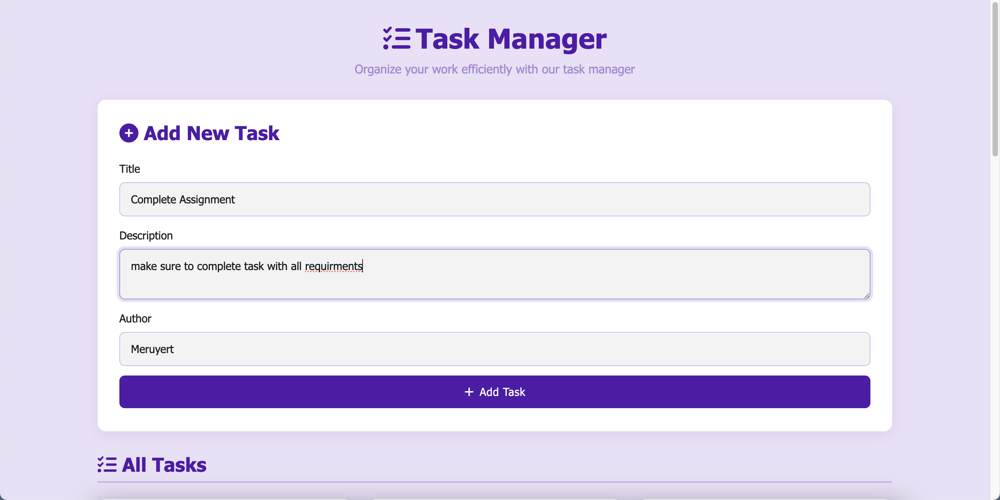

# ToDoList

A simple full-stack ToDo List application built with Node.js, Express, and MongoDB for the backend, and a Bootstrap-powered HTML frontend. Users can add, view, edit, and delete tasks, each with a title, description, and author.

## Features

- Add new tasks with title, description, and author.
- View all tasks in a responsive card layout.
- Edit or delete existing tasks.
- All data is persisted in a MongoDB database.
- RESTful API endpoints for task management.

## Screenshots



## Project Structure

```
ToDoList/
  ├── index.js              # Main Express server and API logic
  ├── package.json          # Project dependencies and scripts
  ├── public/
  │   └── index.html        # Main frontend (Bootstrap, vanilla JS)
  ├── frontForDef.html      # (Empty/unused)
  └── README.md             # Project documentation
```

## Prerequisites

- [Node.js](https://nodejs.org/) (v16+ recommended)
- [MongoDB](https://www.mongodb.com/) (running locally on default port 27017)

## Setup Instructions

1. **Clone the repository:**
   ```sh
   git clone https://github.com/meruyert4/ToDoList
   cd ToDoList
   ```

2. **Install dependencies:**
   ```sh
   npm install
   ```

3. **Start MongoDB:**
   - Make sure MongoDB is running locally. By default, the app connects to `mongodb://localhost:27017/` and uses the `test` database.

4. **Run the application:**
   ```sh
   node index.js
   ```
   - The server will start on [http://localhost:3000](http://localhost:3000).

5. **Access the frontend:**
   - Open your browser and go to [http://localhost:3000](http://localhost:3000) to use the ToDo List app.

## API Endpoints

- `GET /tasks` — List all tasks
- `POST /tasks` — Add a new task (`title`, `description`, `author` in body)
- `GET /tasks/:id` — Get a single task by ID
- `PUT /tasks/:id` — Update a task by ID
- `DELETE /tasks/:id` — Delete a task by ID

## Notes

- The file `frontForDef.html` is present but empty and not used by the application.
- The frontend is served from the `public/` directory.
- All API requests are made to the same server (CORS is not an issue if using the provided frontend).
